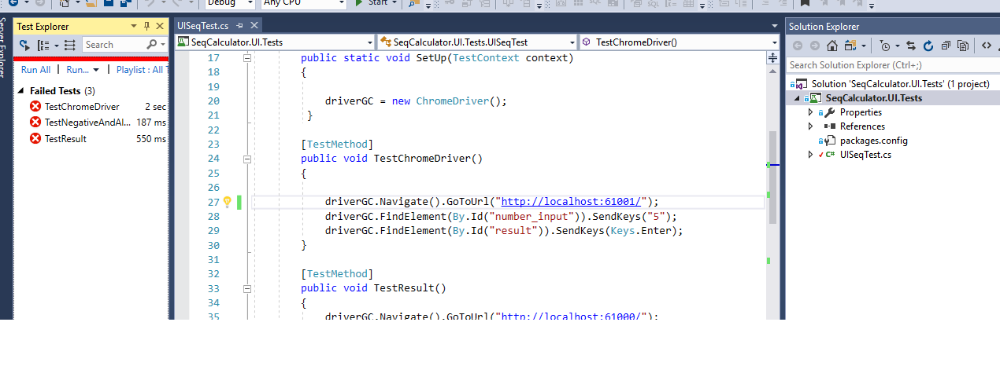

# Sequence Calculator

1. *It uses .net framwork version 4.6.1
2. *It uses microsoft test framework for unit test cases.
3. *It uses Selenium to perfrom UI tests.
	
	### Folder Structure
1. *SeqCalculator has  MVC based web project and Unit test project*
  
2. *SeqCalculator.UI.Tests has end-to-end UI test cases based on Selenium. 
   - UI test has been done only for chrome browser using it's driver.

### How to run test
1. Open SeqCalculator project with current code checked in it should run on 61000 port.
2. Open SeqCalculator.UI.Tests solution/ project:
  - 2.1 This project has been written for chrome and expects that user has chrome driver installed on his/her machine 
3. Run all the test.
4. Check result in the broswer. Green means UI test passed.
 
Run UI test in vs2017:

UI test result:

If UI test fail, errors will be displayed in above picture.

